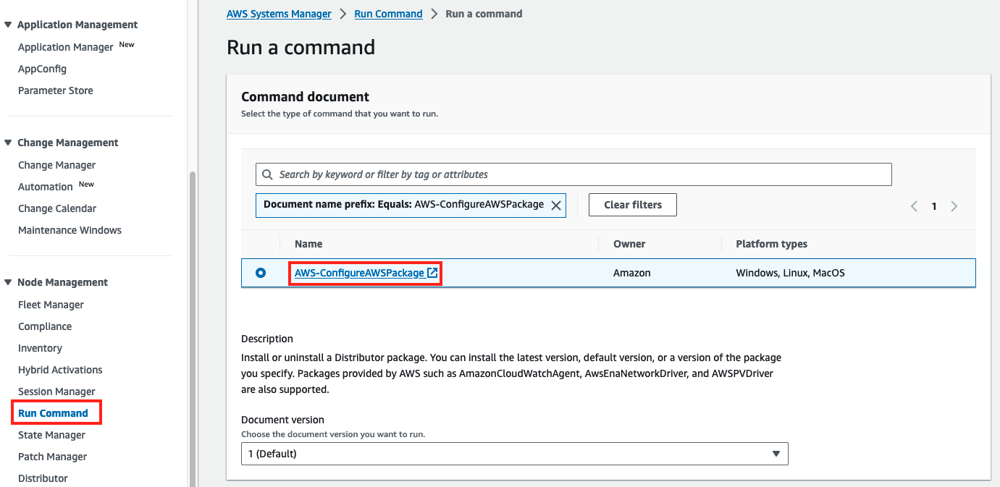

# Optimizing GPU utilization for AI/ML workloads on Amazon EC2

This lab is provided as part of **[AWS Innovate AI/ML Data Edition](https://aws.amazon.com/events/aws-innovate/data/)**,  it has been adapted from the [blog post](https://aws.amazon.com/blogs/compute/optimizing-gpu-utilization-for-ai-ml-workloads-on-amazon-ec2/).

ℹ️ You will run this lab in your own AWS account and running this lab will incur some costs. Please follow directions at the end of the lab to remove resources to avoid future costs.

## Table of Contents  
- [Overview](#overview)
- [Architecture](#architecture)
- [Deploy VPC, Subnet and CloudWatch resources](#deploy-vpc-subnet-and-cloudwatch-resources)
- [\[Optional\] Subscribe to the Amazon Machine Images (AMI) with the NVIDIA drivers pre-installed](#optional-subscribe-to-the-amazon-machine-images-ami-with-the-nvidia-drivers-pre-installed)
- [\[Optional\] Launch GPU-enabled EC2 instances](#optional-launch-gpu-enabled-ec2-instances)
- [\[Optional\] Preparing your own EC2 instances](#optional-preparing-your-own-ec2-instances)
- [Deploying and installing the CloudWatch Agent with the AWS System Manager Console](#deploying-and-installing-the-cloudwatch-agent-with-the-aws-system-manager-console)
- [Configuring the CloudWatch Agent with the AWS System Manager Console](#configuring-the-cloudwatch-agent-with-the-aws-system-manager-console)
- [Visualize your instance's GPU metrics in CloudWatch](#visualize-your-instances-gpu-metrics-in-cloudwatch)
- [Cleaning up lab resources](#cleaning-up-lab-resources)
- [Conclusion](#conclusion)

## Overview

Machine learning workloads can be costly, and AI/ML teams can have a difficult time tracking and maintaining efficient resource utilization. ML workloads often utilize GPUs extensively, so typical application performance metrics such as CPU, memory, and disk usage don’t paint the full picture when it comes to system performance. Additionally, data scientists conduct long-running experiments and model training activities on existing compute instances that fit their unique specifications. Forcing these experiments to be run on newly provisioned infrastructure with proper monitoring systems installed might not be a viable option.

In this lab, you will learn how to track GPU utilization across all of your AI/ML workloads and enable accurate capacity planning without needing teams to use a custom [Amazon Machine Image (AMI)](https://docs.aws.amazon.com/AWSEC2/latest/UserGuide/AMIs.html) or to re-deploy their existing infrastructure. You will use [Amazon CloudWatch](https://aws.amazon.com/cloudwatch/) to track GPU utilization, and leverage [AWS Systems Manager Run Command](https://aws.amazon.com/systems-manager/) to install and configure the Amazon CloudWatch Agent across your existing fleet of GPU-enabled instances. 

## Architecture

This lab is structured in a way that allows you to follow the steps by making use of your exiting GPU-enabled EC2 instances, or, by deploying a set of new instances for testing purpose in this lab.

1. First, you will make sure that your existing GPU-enabled EC2 instances, or the new testing ones deployed for this lab, have the Systems Manager Agent installed, and also have the appropriate level of [AWS Identity and Access Management (IAM)](https://aws.amazon.com/iam/) permissions to run the [Amazon CloudWatch Agent](https://docs.aws.amazon.com/AmazonCloudWatch/latest/monitoring/Install-CloudWatch-Agent.html).
2. During the lab, your CloudWatch Agent configuration will be stored in Systems Manager Parameter Store.
3. You will install and configured the CloudWatch Agent on your existing or testing GPU-enabled EC2 instances from the AWS System Manager, using Systems Manager Documents.
4. GPU metrics will be published to CloudWatch, which you can then visualize through the CloudWatch Metric Console and Dashboard.

Please note that all the steps described below for this lab will be using the **US West (Oregon) (us-west-2)** AWS Region.

## Deploy VPC, Subnet and CloudWatch resources

In this section you will be deploying the CloudFormation template ["optimizing-gpu-lab-infra.yml"](./cloudformation/optimizing-gpu-lab-infra.yml). Below resources will be deployed:

- **[OPTIONAL] Base Infrastructure**: As described in the Architecture section above, you can complete this lab either by using your own set of GPU-enabled EC2 instances, or, you can follow the instructions to deploy a set of **g4dn.xlarge** instances for this lab. If you decide to launch a new instances for this lab, the CloudFormation template have a condition so it will deploy a simple VPC, Public Subnet and Security Group for the new instances to be launched on.
- **CloudWatch Resources**: Together with the optional "Base Infrastructure" resources, the CloudFormation template will also deploy an AWS System Manager Parameter with the CloudWatch Agent configuration to gather GPU related metrics; a pre-configured CloudWatch Dashboard for visualizing the GPU metrics published to CloudWatch; and an IAM role to be attached to the GPU-enabled instances. The IAM role created by the template will allow the instance to communicate with the AWS System Manager (for completing the installation of the CloudWatch Agent) and to CloudWatch (for the agent metrics publication).

1. Download the CloudFormation template ["optimizing-gpu-lab-infra.yml"](./cloudformation/optimizing-gpu-lab-infra.yml). Then, open the [CloudFormation console](https://us-west-2.console.aws.amazon.com/cloudformation/home?region=us-west-2#/stacks) and click on **Create stack**

2. Upload the downloaded template ("optimizing-gpu-lab-infra.yml") and click on **Next**

3. Name the stack as ``gpu-utilization-lab``. If you've decided to use your existing GPU-enabled EC2 instance for this lab then set the parameter **DeployInfra** to *false*. Or, set it to *true* if you will be following the steps in this lab for launching a new set of GPU-enabled instances. Once the name and parameter are defined, click on **Next**

4. In the **Configure stack options** page, leave the default values and click on **Next** at the bottom of the page

5. In the **Review and create** page, scroll to the bottom of the page, check the acknowledgement box and click on **Submit**

6. Wait until the stack deployment is in the "CREATE_COMPLETE" status

## [Optional] Subscribe to the Amazon Machine Images (AMI) with the NVIDIA drivers pre-installed

> **_NOTE:_**  You only need to follow this section if you would like to launch and use a new set of GPU-enabled EC2 instances for completing this lab. In the case you want to use your existing GPU-enabled instances, you can skip this section and continue with the [Preparing your own EC2 instances](#optional-preparing-your-own-ec2-instances) section.

An instance with an attached NVIDIA GPU, such as a P3 or G4dn instance, must have the appropriate NVIDIA driver installed. Depending on the instance type, you can either download a public NVIDIA driver, download a driver from Amazon S3 that is available only to AWS customers, or use an AMI with the driver pre-installed. For the test instances deployed in this lab, you are going to use the Amazon Machine Image (AMI) **Amazon Linux 2 AMI with NVIDIA TESLA GPU Driver** with the driver pre-installed.

Before launching an EC2 instance with this AMI, you will need to subscribe to this AMI via the AWS Marketplace. Note that for this particular AWS Marketplace AMI, you will only get charged for the type of EC2 instance that is eventually launched using the AMI and not for the subscription alone.

1. Make sure that you are still logged in in your AWS Account. Open the [AWS Marketplace **Amazon Linux 2 page for AMI with NVIDIA TESLA GPU Driver**](https://aws.amazon.com/marketplace/pp/prodview-64e4rx3h733ru?sr=0-4&ref_=beagle&applicationId=AWSMPContessa)

2. Click on the **Continue to Subscribe** button at the top-right of the page. Note that there no need to select any region or EC2 instance type in this page (is just for informational use)

1. On the next page, click on **Accept Terms**. Wait until the subscription is completed

1. It should take around 5 minutes for the top banner to show the subscription successful message: *"Thank you for subscribing to this product! You can now configure your software."*. Once you see that message, you can continue to the next section [Launch GPU-enabled EC2 instances](#optional-launch-gpu-enabled-ec2-instances)

## [Optional] Launch GPU-enabled EC2 instances

> **_NOTE:_**  You only need to follow this section if you would like to launch and use a new set of GPU-enabled EC2 instances for completing this lab. In the case that you want to use your existing GPU-enabled instances, you can skip this section and continue with the [Preparing your own EC2 instances](#optional-preparing-your-own-ec2-instances) section.

In this section, you are going to launch two EC2 Instances type **g4dn.xlarge**. The instances will be launched in the sample VPC and Public Subnet deployed during the [Deploy VPC, Subnet and CloudWatch resources](#deploy-vpc-subnet-and-cloudwatch-resources) section. These instances will be using the AMI you have subscribed to from the AWS Marketplace in the previous section.

Note that the **g4dn.xlarge** instance type are priced as **$0.526 (USD)** per hour (more details in the [EC2 pricing page](https://aws.amazon.com/ec2/instance-types/g4/#Product_Details)). So don't forget to follow the [Cleaning up lab resources](#cleaning-up-lab-resources) section at the end of the lab.

1. Open the [EC2 Launch Instance console](https://us-west-2.console.aws.amazon.com/ec2/home?region=us-west-2#LaunchInstances)

2. Change the **Number of instances** to "2" and add the **Name** for the instances as ``My-GPU-Instance``

3. In the **Application and OS Images (Amazon Machine Image)** selection search box, search for the Marketplace AMI: ``Amazon Linux 2 AMI with NVIDIA TESLA GPU Driver``

4. From the search results, open the **AWS Marketplace AMIs** tab and select the **"Amazon Linux 2 AMI with NVIDIA TESLA GPU Driver"** AMI

5. On the pop-up window click on **Subscribe Now** (As you would have completed the Marketplace subscription in the previous section, it will take you back to the EC2 Launch page to continue with the rest of the instance launch settings)

6. For the **Instance type**, select ``g4dn.xlarge``. For **Key pair** dropdown, select "Proceed without a key pair"

7. For the **Network settings**, you need to select the VPC, Subnet and Security Group resources that were created as part of the CloudFormation stack in the [Deploy VPC, Subnet and CloudWatch resources](#deploy-vpc-subnet-and-cloudwatch-resources) section of the lab. For this, open the VPC dropdown and type the same name you have used for the stack name (E.g. ``gpu-utilization-lab``). Also, make sure to select the existing Security Group which name also starts as the stack name:

8. Scroll to the bottom of the page and open the **Advanced details** section. In the **IAM instance profile** dropdown, use the CloudFormation stack name (E.g. ``gpu-utilization-lab``) to search for the IAM profile created by the stack. Make sure to select it

By selecting this IAM instance profile, you make sure that the instances are attached to the IAM role with the proper permissions to interact with AWS System Manager and Amazon CloudWatch.

9. Finally, scroll down to the bottom of the page, and click on **Launch instance**

10.  Now, from the [EC2 Instances console](https://us-west-2.console.aws.amazon.com/ec2/home?region=us-west-2#Instances:tag:Name=My-GPU-Instance;v=3;$case=tags:true%5C,client:false;$regex=tags:false%5C,client:false), you should wait for the two new GPU-enabled instances to be in a "Running" state with status checks "passed"

## [Optional] Preparing your own EC2 instances

> **_NOTE:_**  You only need to follow this section if you are using your own GPU-enabled EC2 instances for completing this lab. In the case you are using the G4dn EC2 test instances launched in above steps, you can skip this section and continue with the [Deploying and installing the CloudWatch Agent with the AWS System Manager Console](#deploying-and-installing-the-cloudwatch-agent-with-the-aws-system-manager-console) section.

In this section of the lab you will make sure that your EC2 instances have the Systems Manager Agent installed and the instance are attached to an IAM role with the right permissions to interact with CloudWatch and System Manager.

**Systems Manager Agent**

Many AWS-provided AMIs already have the Systems Manager Agent installed. For a full list of the AMIs which have the Systems Manager Agent pre-installed, see [Amazon Machine Images (AMIs) with SSM Agent preinstalled](https://docs.aws.amazon.com/systems-manager/latest/userguide/ami-preinstalled-agent.html). If your AMI doesn’t have the Systems Manager Agent installed, see [Working with SSM Agent](https://docs.aws.amazon.com/systems-manager/latest/userguide/ssm-agent.html) for instructions on installing based on your operating system (OS).

**IAM permissions**

Once the Systems Manager Agent is installed, your EC2 instance needs certain permissions so that the CloudWatch Agent can accept commands from Systems Manager, read Systems Manager Parameter Store entries, and publish metrics to CloudWatch. You can make use of the IAM role created in the [Deploy VPC, Subnet and CloudWatch resources](#deploy-vpc-subnet-and-cloudwatch-resources) section of the lab for this:

1. Open the [EC2 Instances console](https://us-west-2.console.aws.amazon.com/ec2/home?region=us-west-2#Instances:v=3;$case=tags:true%5C,client:false;$regex=tags:false%5C,client:false)

2. Click on **Actions** > **Security** > **Modify IAM Role**

3. Open the drop-down and type the same name you have used for the stack name (E.g. ``gpu-utilization-lab``). Select the IAM role and click on **Update IAM role**

**Outbound Internet access**

Note that apart from the IAM permissions, your Amazon EC2 instances must have outbound internet access in order for the CloudWatch Agent to send data to CloudWatch or to interact with System Manager. For more information about how to configure internet access, see [Internet Gateways](https://docs.aws.amazon.com/vpc/latest/userguide/VPC_Internet_Gateway.html) in the Amazon VPC User Guide.

## Deploying and installing the CloudWatch Agent with the AWS System Manager Console

In this section of the lab you will utilize AWS Systems Manager to deploy and install the CloudWatch Agent in your GPU-enabled instances.

1. Open the AWS Systems Manager console and go to the [Run Command page](https://us-west-2.console.aws.amazon.com/systems-manager/run-command/send-command?region=us-west-2#documentName=AWS-ConfigureAWSPackage). In this page make sure that the "AWS-ConfigureAWSPackage" document is selected

2. For the **Command parameters**, make sure that the parameters are set as below:
   - Action: Install
   - Installation Type: Uninstall and reinstall
   - Name: AmazonCloudWatchAgent
   - Version: latest
   - Additional Arguments: Leave it as default ({})

3. In the **Target selection** section, select **Choose instances manually** and select the two "My-GPU-Instance" that you have launched in the previous section (Or, just select the existing GPU-enabled instances you have decided to use for this lab)

4. Leave the other parameters as default, scroll to the bottom of the page and click on **Run**

5. Once the installation finishes, you should see the command **Overall status** as "Success"

At this point the CloudWatch Agent is now installed in the selected instances.

## Configuring the CloudWatch Agent with the AWS System Manager Console

In this section of the lab you will utilize AWS Systems Manager to configure the CloudWatch Agent with the necessary configuration for publishing the GPU consumption metrics into CloudWatch.

**Note:** You can download the CloudWatch Agent JSON configuration file [cw-agent-gpu-conf.json](./cloudformation/cw-agent-gpu-conf.json) and review it in your text editor. For this lab, this same configuration was already stored as a System Manager Parameter in the [Deploy VPC, Subnet and CloudWatch resources](#deploy-vpc-subnet-and-cloudwatch-resources) section of the lab. Visit the [public documentation](https://docs.aws.amazon.com/AmazonCloudWatch/latest/monitoring/CloudWatch-Agent-NVIDIA-GPU.html) for more details about the GPU metrics collected by the agent.

1. Open the AWS Systems Manager console and go to the [Run Command page](https://us-west-2.console.aws.amazon.com/systems-manager/run-command/send-command?region=us-west-2#documentName=AmazonCloudWatch-ManageAgent). In this page, make sure that the "AmazonCloudWatch-ManageAgent" document is selected

2. For the **Command parameters**, make sure that the parameters are set as below:
   - Action: configure
   - Mode: ec2
   - Optional Configuration Source: ssm
   - Optional Configuration Location: CloudWatch-Agent-Config-GPU-Lab (This is the System Manager Parameter store containing the CloudWatch Agent configuration)
   - Optional Restart: yes

3. In the **Target selection** section, select **Choose instances manually** and select the two "My-GPU-Instance" that you have launched in the previous section (Or, just select the existing GPU-enabled instances you have decided to use for this lab)

4. Leave the other parameters as default, scroll to the bottom of the page and click on **Run**

5. Once the installation finishes, you should see the command **Overall status** as "Success"

At this point the CloudWatch Agent is now configured for collecting GPU metrics from the selected instances.

## Visualize your instance's GPU metrics in CloudWatch

Now that your GPU-enabled EC2 instances are publishing their utilization metrics to CloudWatch, you can visualize and analyze these metrics to better understand your resource utilization patterns.

The GPU metrics collected by the CloudWatch Agent for this lab are within the **CWAgentGPU** namespace. You can explore these GPU metrics using the [CloudWatch Metrics console](https://us-west-2.console.aws.amazon.com/cloudwatch/home?region=us-west-2#metricsV2?graph=~()), like below:

For exploring and comparing the GPU metrics, you can also use the sample CloudWatch Dashboard named **My-GPU-Usage** that was deployed as part of [Deploy VPC, Subnet and CloudWatch resources](#deploy-vpc-subnet-and-cloudwatch-resources) section. Open the [CloudWatch Dashboard My-GPU-Usage](https://us-west-2.console.aws.amazon.com/cloudwatch/home?region=us-west-2#dashboards/dashboard/My-GPU-Usage?start=PT3H&end=null), and you will see the dashboard widgets as below:

Note that if you have decided to launch a new set of GPU-enabled EC2 testing instances for completing this lab, you won't see any GPU related utilization (it will show 0% utilization). This is expected, as the new testing instances deployed for this lab wouldn't be running any GPU-enabled application by default unless you configure and run such application. In the case you are using your existing instances with a actual GPU-enabled application running on them, then, you should see utilization metrics patterns as per above example.

## Cleaning up lab resources

1. **Only if you have launched new G4dn instances for this lab**, navigate to [the EC2 Console page](https://us-west-2.console.aws.amazon.com/ec2/home?region=us-west-2#Instances:tag:Name=My-GPU-Instance;v=3;$case=tags:true%5C,client:false;$regex=tags:false%5C,client:false), select the G4dn instances (named ``My-GPU-Instance`` as per instructions in the lab). Then click on **Instance state** > **Terminate instance**

2. Open the [CloudFormation console](https://us-west-2.console.aws.amazon.com/cloudformation/home?region=us-west-2#/stacks), select the stack deployed for this lab (``gpu-utilization-lab``) and click on **Delete**

## Conclusion

Throughout this lab, you have learn how to deploy and configure the CloudWatch Agent across your GPU-enabled EC2 instances to track GPU utilization without pausing in-progress experiments and model training. Then, you learn how to visualize the GPU utilization metrics of your instances with a CloudWatch Dashboard. Using this approach in a real scenario would allow you to better understand your workload's GPU usage and make more informed scaling and cost decisions.

As described in the [AWS Well-Architected Framework](https://aws.amazon.com/architecture/well-architected), not collecting usage metrics for your accelerated computing GPU instances is a common anti-pattern against Well-Architected best practices. 

Collecting performance-related metrics for your GPU-enabled workloads and instances will help you align application performance with your business requirements to ensure that you are meeting your workload needs. It can also help you to continually improve the resource performance and utilization in your workloads.

Also, collecting GPU utilization metrics will allow you to compare your workload actual usage with the anticipated usage level. This way you can make inform decisions in terms of cost optimization, and choose the correct resource type and size for your GPU workloads.

Visit the [AWS Well-Architected Framework white paper](https://docs.aws.amazon.com/wellarchitected/latest/framework/welcome.html) and below related Best Practices for more information:

- [PERF02-BP06 Use optimized hardware-based compute accelerators](https://docs.aws.amazon.com/wellarchitected/latest/framework/perf_compute_hardware_compute_accelerators.html)
- [PERF02-BP03 Collect compute-related metrics](https://docs.aws.amazon.com/wellarchitected/latest/framework/perf_compute_hardware_collect_compute_related_metrics.html)
- [COST06-BP02 Select resource type, size, and number based on data](https://docs.aws.amazon.com/wellarchitected/latest/framework/cost_type_size_number_resources_data.html)
